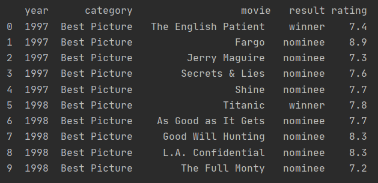

# projects_api

# Table of Contents
1. [API Project](#api-project)
2. [Using this repository](#using-this-repository)
3. [Installation and configuration](#installation-and-configuration)
4. [API Limitation](#api-limitation)


# API Project

This project aims to use APIs to obtain information from different sources in order to populate an oscar winner/nominees 
dataframe. 

The first source will be an engine from Wolfram Research called [Wolfram Alpha](https://products.wolframalpha.com/api/). We'll obtain the oscar winner and 
nominees for "Best Picture" per every year requested in our script.

The second source will be [imdb-api](https://imdb-api.com/) a web service providing film information. Here we'll get the ID of the film which 
will allow us to get the Imdb rating from the movie in the same API.

The program will create the dataframe, request the information to both APIs and populate the dataframe. We'll end with 
a dataframe that will contain the year of nomination requested, category (Best Picture), movie name, result of the awards 
(winner/nominee) and the IMDB rating.




## Using this repository

In order to run this repository locally you'll need to have Python installed.
* Clone the repository
          
* Get Wolfram Alpha key for the API. 
    * Go to [https://products.wolframalpha.com/api/](https://products.wolframalpha.com/api/) create a user and sign in.
    * Go to ```Get an AppId```
    * Once the Id appear, enter to edit it. Here you'll find the AppID number that's your API key.
            
* Get IMDB key for the API. 
    * Go to [https://imdb-api.com/](https://imdb-api.com/) create a user and sign in.
    * Go to user/profile/profile
    * Copy the API Key
    
* Create the environment variables with the keys (Review [Installation and configuration](#installation-and-configuration))
            
* Go to the following script: ``` oscar_moving_ratings.py```
    * Replace the years you want to consult. Go the variables ``` oscar_list_first_year```  and 
    ``` oscar_list_last_year```  and replace both years. If you want to get the results of only one year, fill that year 
    in both variables. Beware of the API limitations, check [API Limitation](#api-limitation) for more information.
    * Run the script
    
    

## Installation and configuration


To run the scripts locally you will need to have installed:
* Python v.3.x.x
* Libraries
    * pandas:1.1.3
    * json:2.0.9 
    * requests:2.24.0
    * re:2.2.1


As it was detailed in [Using this repository](#using-this-repository) you will need to create the 
Wolfram Alpha & IMDB keys to use each API. 
Once you have the keys please make sure to create the following environment variables with your 
keys:

* WA_KEY
* IMDB_KEY


# API Limitation

Public API usually have limitation in the amount of calls allowed to users with free accounts.
Below you can found the limitation of each API:

* Wolfram Alpha API: 2000 calls per month
* IMDB API: 100 calls per day

In view of the fact that the program makes two calls to IMDB API per movie (request Id & request rating) please 
note that the amount of movie consultations per day will be limited to 50 movies.
